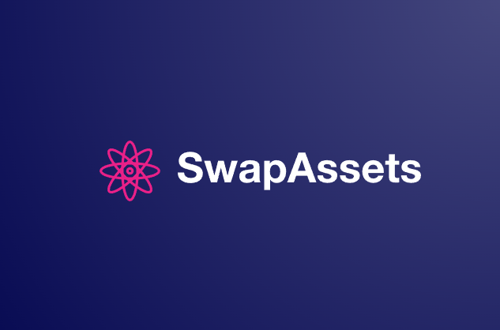
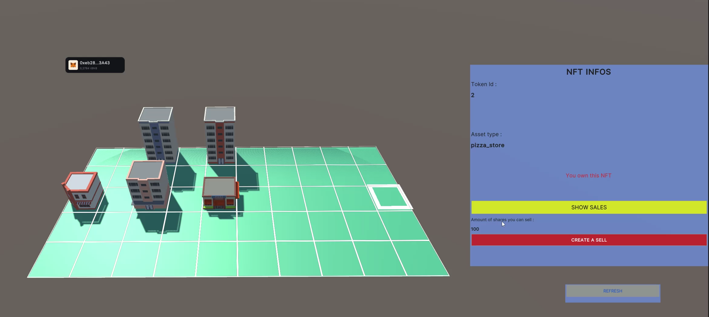
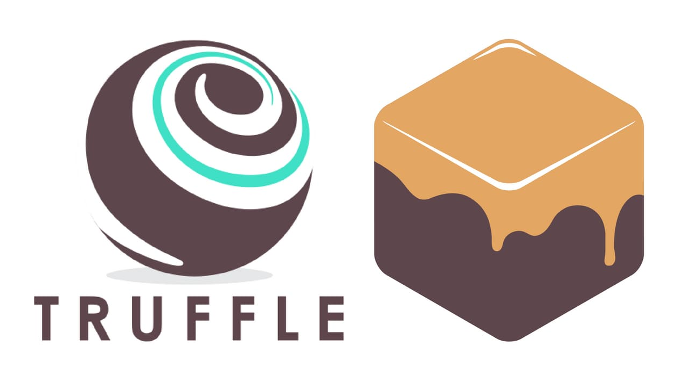
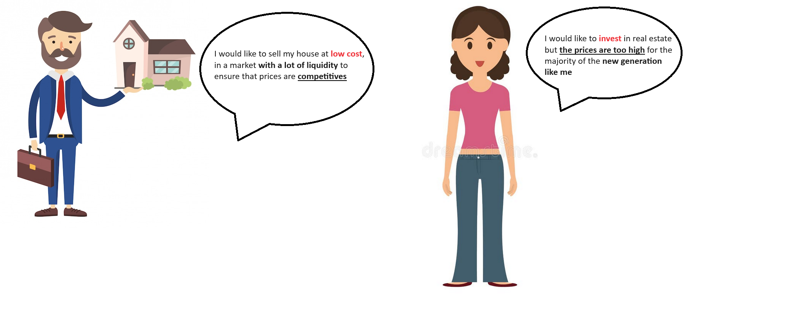
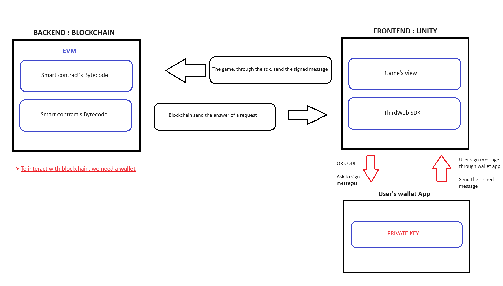

# SwapAssets development :
### Made so far :
  - Smart contract -> conception/development
  - Smart contract tests -> 23 tests made with TruffleJS

### Under development :
  - 3D assets Launcher [Unity]
  - SwapAssets Dapp [ReactJS]

# What is SwapAssets ?

SwapAssets is a web3 tokenisation project of real estate assets.
In the backend, it’s using the technologie of blockchain and a smart 
contract in it, to tokenize the real estate assets in the form of NFTs.

The smart contract manage the life cycle of these NFTs, such as :
- buy 
- sell 
- fractionation

To have a better overview of the project, please read the "conception document".

## SwapAssets 3D Launcher :

With the 3D launcher made with Unity (that can be download in the "SwapAssets-Project" folder), users can connect their wallet with their mobile app wallet, through a QR Code and then start buy, sell and trade assets in the SwapAssets smart contract exchange.

Video that present the project (part1) : https://youtu.be/qaHHLDTYIO4

## Smart Contract Exchange

To work, SwapAssets use the blockchain with a smart contract. The smart contract not only act as a traditional exchange, it can actually divide an NFT into multiple fractions, to make the NFT ownable by multiple owners.
The smart contract is working properly, has been tested with Truffle and can be found in the file name "Smart Contract".

## Smart Contract test quality

To ensure the quality of the smart contract, multiple tests has been made with Truffle tool. These tests can be found in the folder "smart-contract-test-truffleJS".

## SwapAssets user stories

The solution has been created with the help of the agile framework. All the users stories can be found in the file "user-stories".

## Architecture

On the frontend, the project use an 3D engine to gives at users an overview 
of all the actual assets, in a given area.

In SwapAssets, users can :
- select an NFTs to get their infos.
- create a sale ticket to list their NFTs on the exchange with the 
conditions of their choice : price and the shares to sell.
- buy a sale ticket of an NFT to become the or one of the owners.

